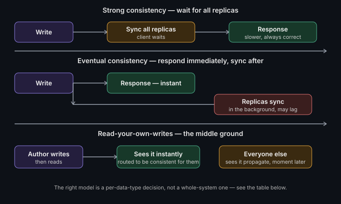

# Consistency models: strong vs eventual

**Watch (~1.5 min):** [Coming Soon] · **Read time:** 3 min

---

Your database lied to you about being "consistent."

You read your account balance right after a transfer, and it shows the old
number. That's not a bug — it's a design decision, somewhere in your stack,
that traded correctness for speed. Whether that trade was the right one
depends entirely on what the data actually is.

## Strong vs eventual, plainly

**Strong consistency** — every read sees the latest write, guaranteed,
everywhere. The cost is latency: you're often waiting on a quorum of nodes
to agree before you can respond to the client.

**Eventual consistency** — reads might return stale data for a while, but
given enough time with no new writes, every replica converges to the same
value. The payoff is speed and availability: you're not blocked waiting for
every node to agree before responding.

Neither is "better." They're a trade between correctness-under-concurrency
and latency/availability, and the right answer changes per data type, not
per system.

## The middle ground nobody mentions enough

**Read-your-own-writes consistency**: the user who just made a change
always sees it immediately. Everyone else may see it propagate a moment
later. This covers a huge chunk of "this needs to feel consistent" cases —
profile edits, posted comments, settings changes — without paying for full
strong consistency across the board.

## The actual skill: picking per data type, not per system

| Data | Model | Why |
|---|---|---|
| Ledger balance, inventory count for last item | **Strong** | Correctness under concurrency is non-negotiable — two people can't both "win" the last unit |
| Profile edits, posted comments | **Read-your-own-writes** | The author needs to see it instantly; propagation delay to others is invisible and harmless |
| View counters, like counts, recommendation feeds | **Eventual** | Being off by a few for a moment costs nothing, and forcing strong consistency here just adds latency for no benefit |

The mistake most systems make isn't picking the wrong model overall — it's
applying one model uniformly across data that has genuinely different
correctness requirements.

## Best Practices

- Classify each data field's consistency need explicitly — strong,
  read-your-own-writes, or eventual — rather than inheriting whatever the
  database's default happens to be.
- For anything in the "strong" tier, verify the guarantee under real
  concurrent load in staging, not just in isolated unit tests.
- For "read-your-own-writes," make sure the routing (session affinity to
  a specific replica, or reading from the primary right after a write)
  is implemented deliberately — it's easy to assume you have this
  property when you actually don't.
- Revisit these classifications whenever a system scales into
  multi-region — cross-region replication lag turns "eventual, usually
  fast" into "eventual, sometimes seconds," and downstream assumptions
  built for the fast case can break.

---

**Where in your system are you paying for strong consistency you don't
actually need — or worse, missing it where you do?** Open an issue or drop
a comment on the video.

*Part of [System Design & Architecture](../README.md) → [Core Concepts](./README.md)*
