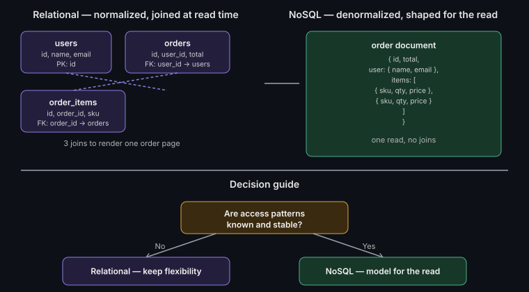

# Data modeling: relational vs NoSQL

**Watch (~1.5 min):** [Coming Soon] · **Read time:** 3 min

---

Schema first, or schema never?

Most "relational vs NoSQL" debates online are religious wars. In
production, it's not a preference — it's a question your access patterns
already answered before you wrote a line of code. Get the model wrong and
you're not fighting syntax, you're fighting your own database on every
query.

## What each actually optimizes for

**Relational** databases model relationships explicitly — foreign keys,
joins, normalization. You get strong consistency and flexible querying,
because you don't have to know every future query shape in advance. The
cost: joins get expensive at scale, and horizontal scaling is harder.

**NoSQL** — document, key-value, wide-column — models data the way you're
going to read it, denormalized upfront. Reads are fast because there's no
join to compute. The cost: you paid for that speed by deciding your query
patterns in advance. Change the access pattern later, and you're reshaping
the whole model.

## The decision rule that actually matters

Ask one question: **are your access patterns known and stable, or unknown
and evolving?**

- **Unknown/evolving access patterns** — internal admin tools, analytics,
  anything ad-hoc-query-heavy → **relational wins**. SQL lets you ask new
  questions of old data without a redesign.
- **Known/fixed access patterns** — a product catalog page, a user profile
  screen, a leaderboard → **NoSQL wins**. Model the document exactly the
  shape your read query needs, and it will outperform a normalized schema
  doing three joins for the same page load.

## The mistake that costs teams the most

Picking NoSQL for perceived scale reasons, then discovering six months in
that the product actually needs join-heavy, flexible queries — the exact
thing relational was built for. Scale is rarely the real constraint early
on; query flexibility is the more common bottleneck that gets mistaken for
a scale problem.

## In practice: hybrid is normal

Most production systems worth their salt aren't purely one or the other —
a relational system of record for the data that needs joins and strong
consistency, with a denormalized read-optimized store (cache, search index,
or NoSQL projection) for the high-traffic read paths. Treat "relational vs
NoSQL" as a per-table decision, not a whole-system one.

## What we'd do differently

*ToDo*

---

**Have you picked the wrong model and had to migrate mid-project?** What
forced the switch? Open an issue or drop a comment on the video.

*Part of [System Design & Architecture](../README.md) → [Core Concepts](./README.md)*
