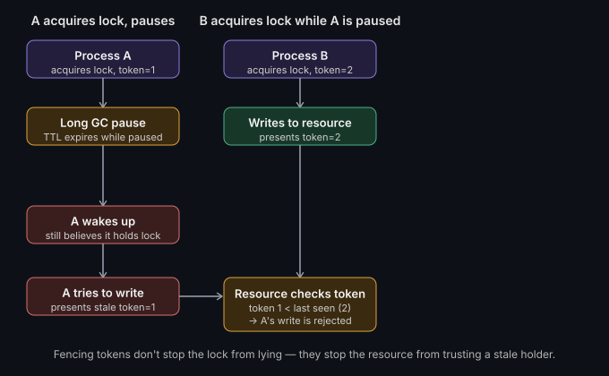

# Distributed locking & coordination

**Read time:** 3 min

---

A lock on a single machine is easy — the OS guarantees mutual exclusion.
A lock across multiple machines, where any of them can crash mid-operation
or fall behind on the network, is a fundamentally harder problem, and it's
worth knowing why before reaching for a library.

## What distributed locking is for

Ensuring only one process (across multiple machines/instances) can hold a
resource or perform an action at a time — e.g., only one instance of a
scheduled job should run at once, even though 5 replicas of the service
are deployed.

## Common approaches

- **Database-based locks:** a row with a unique constraint, or a
  `SELECT ... FOR UPDATE`. Simple, reuses infrastructure you already have,
  but ties lock performance to your database's load.
- **Redis-based locks (e.g. `SETNX` with a TTL, or Redlock):** fast, widely
  used — but naive implementations have real correctness gaps under
  certain failure scenarios (a process pausing longer than the lock's TTL
  can lose the lock while still believing it holds it, then two processes
  both think they own the resource).
- **ZooKeeper/etcd (consensus-based coordination):** built specifically
  for this — uses a consensus protocol (ZAB for ZooKeeper, Raft for etcd)
  to provide strongly consistent locks with proper session/lease
  semantics. Higher operational overhead to run, but the correctness
  guarantees are much stronger than a bare Redis lock.

## The failure mode that actually matters: the pause problem

A process acquires a lock, then experiences a long pause — a GC pause, a
slow disk write, a network delay — long enough for the lock's TTL to
expire. The lock system, having no way to know the process is still
"alive" in the sense that matters, gives the lock to someone else. The
original process resumes, still believing it holds the lock, and now two
processes are both acting as if they have exclusive access.

This is why naive `SETNX`-with-TTL locks are risky for anything where a
double-execution would be genuinely harmful (e.g., double-charging,
double-shipping) — the lock protects against the common case, not the
pause case.

## Fencing tokens: the actual fix

A monotonically increasing token issued with each lock acquisition. The
resource being protected checks that the token presented is higher than
the last token it saw — if a "zombie" process resumes after losing its
lock and tries to act with a stale token, the resource rejects it, because
a newer token has already been issued to whoever holds the lock now. This
turns "the lock might lie" into "even if the lock lies, the protected
resource won't accept stale writes."

## The actual skill

Match the tool to the actual risk: a Redis-based lock is fine for
"probably only one instance of this cron job should run" where an
occasional double-run is a minor inefficiency, not a correctness
disaster. Use ZooKeeper/etcd-grade coordination, with fencing tokens, when
double-execution has real consequences.

## What we'd do differently

*(Fill this in with a real story once you've shipped this in production —
this section is what separates the post from a textbook definition.)*

---

**Have you hit the "lock expired mid-pause" bug? What did it cost before
you found it?**

*Part of [System Design & Architecture](../README.md) → [Core Concepts](./README.md)*
