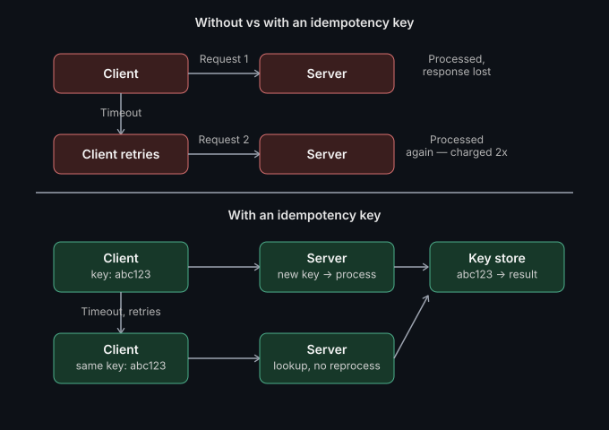

# Idempotency & exactly-once delivery

**🎥 Video: coming soon** — [subscribe on YouTube](https://www.youtube.com/@abhijeetbatsa) to get notified when it's up · **Read time:** 3 min

---

Your retry logic is lying to you.

Here's the failure that catches almost everyone at least once: a network
times out mid-request. The client retries the payment call. But the server
had actually processed it the first time — it just never got the response
back before the connection dropped. Now your customer's been charged
twice. Nobody wrote bad code. The system did exactly what it was told.

## What idempotency actually means

An idempotent operation — call it once, call it five times, same end
result. Not "nothing happens on retry." The *same* thing happens, exactly
once's worth, no matter how many times the request lands.

The part that trips people up: the client can't guarantee exactly-once
delivery. Networks drop packets, timeouts happen, clients panic and retry.
So exactly-once *behavior* has to be enforced on the server, not assumed on
the client.



## How it actually works

In a real payment system: the client generates a unique idempotency key —
a UUID — before the first attempt, and sends it in the request header. The
server checks: have I seen this key before?

- First time → process it, store the result against that key.
- Every retry after that, same key → server just returns the stored
  result. No reprocessing.

```
POST /payments
Idempotency-Key: abc123-def456-...

// First request: server processes, stores result keyed to abc123-def456
// Retry with same key: server returns cached result, doesn't reprocess
```

## The part most people get wrong

The idempotency key has to be scoped correctly, **and it needs a TTL**.

- Store keys forever and your table grows unbounded.
- Expire them too fast and a slow retry after the window closes processes
  twice anyway.

Most payment gateways expire idempotency keys somewhere between 24 hours
and a few days — worth verifying against the specific provider's current
docs rather than assuming a default, since this window is a real design
decision, not boilerplate.

## Where this applies beyond payments

Idempotency keys aren't optional for anything that moves money, sends a
notification, or triggers an irreversible action:

- Payment/refund processing
- Sending emails/SMS/push notifications
- Provisioning infrastructure or resources
- Any webhook consumer (the sender will retry on timeout — guaranteed)

If your API doesn't support one for these operations, that's not a minor
gap — it's a double-charge (or double-send) waiting to happen.

## What we'd do differently

Early in a product launch, we integrated a payment gateway for real-money
transactions — and idempotency wasn't part of the first cut. It worked fine
in testing. Then it hit production traffic on a flaky mobile network, and
the first support tickets rolled in: customers charged twice for the same
order. The retry fired before the original response ever came back, and the
server did exactly what it was told — processed both.

We fixed it by adding an idempotency key at the transaction level, scoped
to the specific order and payment attempt. The moment that shipped, the
behavior changed completely — the same transaction, retried five times by a
client stuck on a bad connection, resulted in exactly one debit. Every
retry after the first just got handed back the same result.

But there was a second lesson buried in that fix, and it's the part most
idempotency write-ups skip entirely: **the retry has to happen on the same
rail as the original attempt.** If a transaction was initiated on a
specific UPI handle, or through a specific bank's net banking flow, you
can't let the retry hop to a different UPI app or a different bank
mid-flight and expect the idempotency key to still hold — the reference the
rail itself issued downstream is tied to that specific channel, not to your
system's key alone.

So the correct behavior on a failed or stuck attempt wasn't "let the
customer immediately try a different payment method." It was: let this
attempt either complete or fail cleanly on its original rail first — only
*then* allow a fresh attempt, same rail or a different one, as a genuinely
new transaction. Get that sequencing wrong, and you reintroduce the exact
bug idempotency was supposed to kill — just one layer up, at the
rail-switching level instead of the retry level.

---

**Where has a missing idempotency key bitten you?** Open an issue or drop
a comment on the video — I'll probably have a worse story.

*Part of [System Design & Architecture](../README.md) → [Core Concepts](./README.md)*
