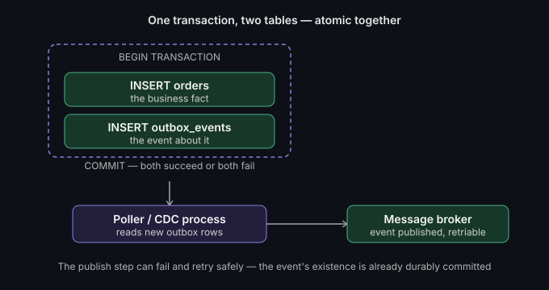

# Outbox pattern & transactional messaging

**Read time:** 3 min

---

Here's a bug that looks correct in code review: write to the database,
then publish an event to a message queue. Looks fine. It isn't — because
those are two separate systems, and there's no transaction spanning both.

## The problem this solves

If the database write succeeds and the message publish fails (network
blip, broker down), you've silently lost an event — downstream systems
never hear about a change that actually happened. If you flip the
order — publish first, then write to the database — and the *database*
write fails, you've now told the world about something that never actually
happened. Either order has a failure window where the two systems disagree.

This is the **dual-write problem**: writing to two different systems
(a database and a message broker) isn't atomic, and there's no distributed
transaction across them in most real setups.

## The fix: the outbox table

Instead of writing to the database *and* publishing to the broker as two
separate operations, write **both the business data and the event** to
the same database, in the same transaction:

```
BEGIN TRANSACTION
  INSERT INTO orders (...) VALUES (...);
  INSERT INTO outbox_events (event_type, payload, created_at)
    VALUES ('order_created', '{...}', now());
COMMIT
```



Both inserts succeed or fail together — normal ACID transaction
guarantees, no distributed transaction needed. A separate process (a
poller, or a database change-data-capture stream like Debezium) then reads
new rows from `outbox_events` and publishes them to the actual message
broker, marking them as sent once confirmed.

## Why this actually works

The hard part (atomicity between "the business fact" and "the event about
that fact") gets pushed onto something that already solved
atomicity — the database transaction. The message broker publish step
becomes a separate, retriable, at-least-once operation that can fail and
retry without ever risking data/event disagreement, because the event's
existence is already durably committed before publishing is even
attempted.

## The trade-off

You've traded a dual-write consistency problem for an extra table, a
poller/CDC process, and slightly more publishing latency (events go out
on the next poll cycle, not instantly). For anything where "the event and
the fact must never disagree" matters — order confirmations, payment
events, inventory changes — that trade is almost always worth it.

## Common mistake

Forgetting to clean up the outbox table. Published events should be
marked processed (or deleted) after confirmed delivery — an outbox table
that grows forever becomes its own performance problem.

## Best Practices

- **Always add a cleanup/archival job for processed outbox rows** — an
  outbox table that grows forever becomes its own performance problem
- **Index the outbox table on `(processed, created_at)`** so the poller
  can find new rows without scanning the whole table as it grows
- **Prefer CDC (e.g. Debezium) over polling once volume justifies it** —
  lower latency and less load on the database than a polling loop
- **Version the outbox event payload schema** from day one — consumers
  will need to handle schema evolution eventually, plan for it early
- **Alert on outbox table growth** as an early warning signal — a
  growing backlog usually means the publisher process is stuck, not that
  traffic increased

---

**Have you hit the dual-write problem before you knew this pattern had a
name?**

*Part of [System Design & Architecture](../README.md) → [Core Concepts](./README.md)*
