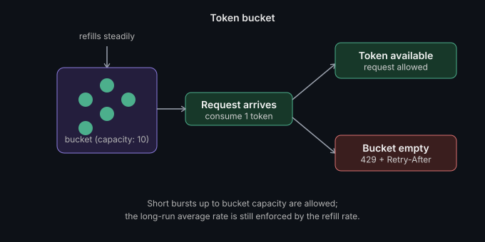

# Rate limiting & backpressure

**Read time:** 3 min

---

Rate limiting protects you from clients. Backpressure protects you from
yourself. They get talked about interchangeably and they're solving
different problems.

## Rate limiting

Enforcing a cap on how many requests a client can make in a given window —
protects the system from a single client (malicious or just buggy)
overwhelming shared resources.

**Common algorithms:**

- **Fixed window:** count requests in a fixed time window (e.g. per
  minute), reset the counter at the boundary. Simple, but has a real
  flaw — a burst right at the window boundary (end of one window plus
  start of the next) can let through nearly 2x the intended rate.
- **Sliding window:** smooths that boundary problem by considering a
  rolling window instead of fixed boundaries — more accurate, slightly
  more bookkeeping.
- **Token bucket:** a bucket refills with tokens at a steady rate; each
  request consumes a token. Naturally allows short bursts (up to the
  bucket's capacity) while enforcing a long-run average rate — the
  algorithm most production rate limiters actually use, because it
  handles bursty-but-legitimate traffic gracefully.
- **Leaky bucket:** requests queue up and are processed at a constant
  output rate, regardless of burstiness on input — smooths traffic out
  rather than allowing bursts through.

## Backpressure

A mechanism for a system to signal "slow down" to something feeding it
work, when it can't keep up — protecting the system from **its own
downstream dependencies**, not from external clients.

Concretely: if a queue consumer can't keep up with the producer, the queue
grows unboundedly, memory pressure builds, and eventually something falls
over — unless there's a backpressure mechanism: the producer slows down,
or new work gets rejected/buffered with a bound, once the consumer signals
it's falling behind.

## Where they actually meet in a real system

Rate limiting sits at the edge (API gateway, load balancer) protecting
against external load. Backpressure operates internally, between your own
services and their queues/downstream dependencies. A well-designed system
needs both — rate limiting alone doesn't protect you from your own
internal service being slower than upstream expects, and backpressure
alone doesn't protect you from an external client hammering your API.

## The mistake that actually hurts

Rate limiting with no client feedback. Silently dropping requests once a
limit is hit, instead of returning a proper `429 Too Many Requests` with a
`Retry-After` header, turns a manageable client-side backoff into a
guessing game — well-behaved clients can't self-correct if they don't know
they've been throttled.

## What we'd do differently

*(Fill this in with a real story once you've shipped this in production —
this section is what separates the post from a textbook definition.)*

---

**What's the last incident where missing backpressure (not rate limiting)
was the actual root cause?**

*Part of [System Design & Architecture](../README.md) → [Core Concepts](./README.md)*
