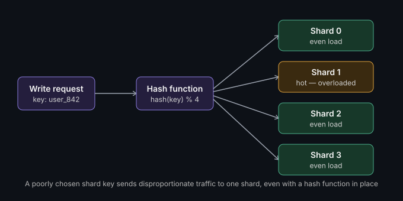

# Sharding & partitioning

**Watch (~1.5 min):** [Coming Soon] · **Read time:** 3 min

---

One database can't hold your entire company forever.

At some point, a single database instance runs out of road — not because
your data got too big for a disk, but because write throughput on one node
has a ceiling, and you've hit it. Vertical scaling (a bigger machine) buys
you time, not a solution.

## What sharding actually is

Sharding — also called horizontal partitioning — splits your data across
multiple database instances, each holding a slice. No single node holds the
whole dataset, so no single node bottlenecks writes for everyone.

The entire game is choosing the **shard key** — the field that decides
which shard a row lives on. Get this right and traffic spreads evenly. Get
it wrong and you've built a distributed system that still bottlenecks on
one shard, just with extra network hops now.

## Three common strategies

| Strategy | How it works | Trade-off |
|---|---|---|
| **Range-based** | Shard by ID ranges (e.g. users 1-1M on shard 0) | Simple, but creates hotspots — new data always lands on the newest shard |
| **Hash-based** | Hash the shard key, spread writes evenly | Even load, but range queries now have to fan out to every shard |
| **Geo-based** | Shard by region | Great for data locality and compliance, but uneven if one region has disproportionate traffic |

## The part that actually hurts in production

It's not picking a strategy — it's **resharding**. Your shard count was
right for a million users, now you're at ten million and one shard's
overloaded. Moving data between shards live, without downtime, is one of
the hardest operational problems in distributed systems.

Which is exactly why picking a shard key that **scales**, not just one that
works today, matters more than which strategy you start with. A shard key
tied to a naturally growing, evenly-distributed attribute (like a hashed
user ID) ages better than one tied to something that clusters (like
signup date, or a single high-traffic tenant ID in a multi-tenant system).

## A hotspot in practice

Even with a hash function in place, a poorly chosen shard key can still
concentrate traffic — for example, sharding by `tenant_id` in a B2B SaaS
product where one enterprise customer generates 40% of total traffic. The
hash spreads *keys* evenly; it doesn't know or care that one key's traffic
volume dwarfs the others. That's a design conversation that has to happen
before the shard key is chosen, not after the hot shard starts paging you.

## What we'd do differently

*(Fill this in with a real story once you've shipped this in production —
this section is what separates the post from a textbook definition.)*

---

**What shard key have you regretted picking six months later?** That story
is worth more than the theory. Open an issue or drop a comment on the video.

*Part of [System Design & Architecture](../README.md) → [Core Concepts](./README.md)*
